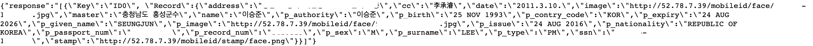

##Hyperledger Fabric Nodejs SDK 와 ExpressJS 사용하여 서버구축하기

### 시작하기전에

* https://github.com/sjlee1125/Multi-Host-Fabric-Network 참조하여 기본적인 네트워크 구성

* 이번에는 chaincode_example02 코드가아닌 fabcar chaincode를 설치한다.

  ```sh
  change Org1-Peer0
  $ peer chaincode install -n fabcar -v 1.0 -p github.com/hyperledger/fabric/examples/chaincode/go/fabcar
  change Org1-Peer1
  $ peer chaincode install -n fabcar -v 1.0 -p github.com/hyperledger/fabric/examples/chaincode/go/fabcar
  change Org2-Peer0
  $ peer chaincode install -n fabcar -v 1.0 -p github.com/hyperledger/fabric/examples/chaincode/go/fabcar
  change Org2-Peer1
  $ peer chaincode install -n fabcar -v 1.0 -p github.com/hyperledger/fabric/examples/chaincode/go/fabcar
  ```

* Instantiate Chaincode

  ```sh
  $ peer chaincode instantiate -o orderer0.example.com:7050 -C mychannel -n fabcar -v 1.0 -c '{"Args":[""]}' -P "OR ('Org1MSP.member','Org2MSP.member')"
  ```

* Invoke Chaincode

  ```sh
  $ peer chaincode invoke -o orderer0.example.com:7050 -C mychannel -n fabcar -c '{"function":"initLedger","Args":[""]}'
  ```

* Query Chaincode

  ```sh
  $ peer chaincode query -o orderer0.example.com:7050 -C mychannel -n fabcar -c '{"function":"queryAllCars","Args":[""]}'
  ```

  Query후 Json형식의 text출력하면 완료


### ExpressJS사용하여 Server구축

* node libraries install

  ```sh
  $ cd hfc-nodejs
  $ npm install
  ```

* Admin 등록

  hfc_enrollAdmin.js의 42번째줄 수정

  ca를 가지고있는 주소와 포트, ca의 aliases된 network에서의 이름

  ```sh
  fabric_ca_client = new Fabric_CA_Client('org1의 ca주소', tlsOptions , 'org1 ca의 aliases된 network에서의 이름', crypto_suite);
  -> fabric_ca_client = new Fabric_CA_Client('http://test-pc4:7054', tlsOptions , 'ca.org1.example.com', crypto_suite);
  
  ```

  수정후 아래의 명령어 수행

  ```sh
  $ node hfc_enrollment.js
  ```

* User 등록hfc_registerUser.js의 42번째줄 수정

  ca를 가지고있는 주소와 포트, ca의 aliases된 network에서의 이름

  ```sh
  fabric_ca_client = new Fabric_CA_Client('org1의 ca주소', tlsOptions , '', crypto_suite);
  -> fabric_ca_client = new Fabric_CA_Client('http://test-pc4:7054', tlsOptions , '', crypto_suite);
  
  ```

  수정후 아래의 명령어 수행

  ```sh
  $ node hfc_registerUSer.js
  ```

* 아래의 명령어로 완료되었는지 확인

  ```sh
  $ node hfc_query.js
  ```

* Install ExpressJS 

  ```sh
  $ npm install express --save
  ```

* Server 구동

  ```sh
  $ node hfc_server.js 
  ```

* Testing

  브라우저에 아래의 텍스트 입력

  ```sh
  "PC4의 IP주소":8081/api/query
  ```

  

  

  

